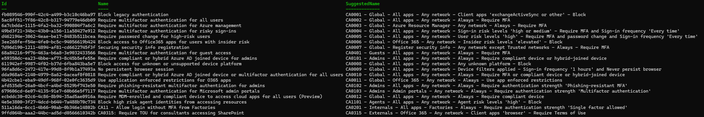
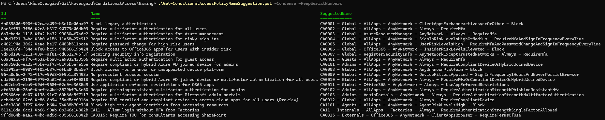
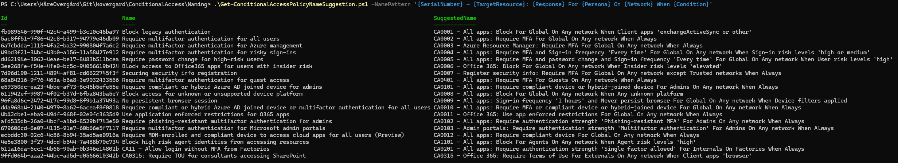

# Descriptive Conditional Access Naming

One thing I often feel is missing from Conditional Access policies, is the ability to add a description to the policies, documenting their purpose. 

Instead, we are limited to whatever information we can cram into the name of the policy, and there are a lot of different approaches to naming.

## Naming standards

The following are some of the most common naming standards that I have encountered. You might be using one of these already, or have invented your own. 

**Microsoft-managed policies**

Microsoft-managed policies, and policies based on templates provided in the Conditional Access management portal, use sentence-like names like:
```
Block legacy authentication
Securing security info registration
Require compliant or hybrid Azure AD joined device or multifactor authentication for all users
```
**Suggested naming standard from Learn**

[Guidance](https://learn.microsoft.com/en-us/entra/identity/conditional-access/plan-conditional-access#set-naming-standards-for-your-policies) from the Microsoft Learn site suggest using a standard prefixed with a serial number on this format:

```
<SN> - <Cloud app>: <Response> For <Principal> When <Conditions>
```
which will give you names like this:
```
CA01 - Dynamics CRP: Require MFA For Marketing When On external networks
```

**Conditional Access Guidance for Zero Trust**

For a while, Microsoft Learn linked to a GitHub repository with guidance for using Conditional Access in the Zero Trust framework, and that content is still available [here](https://github.com/microsoft/ConditionalAccessforZeroTrustResources).

This framework suggests compact names with serial numbers and personas (See Component reference below), and contain the functionality of the policy:

```
CA100-Admins-BaseProtection-AllApps-AnyPlatform-CompliantandMFA
CA206-Internals-DataandAppProtection-AllApps-iOSorAndroid-ClientAppORAPP
CA403-Guests-IdentityProtection-AllApps-AnyPlatform-BlockLegacyAuth
```

This original repository work has not been updated since October 2023. Fortunately, others like MVP Joey Verlinden with his [Conditional Access Baseline](https://github.com/j0eyv/ConditionalAccessBaseline) project, have created updated policies using the similar naming.

## A different approach – automating descriptive names

Whatever "manual" standard used for naming your Conditional Access policies, you can still encounter issues like these:
* When working in an environment with multiple administrators, naming standards might be unintentionally ignored. 
* Some policies might have been created by admins that have left the company, and might have a misleading name.
* The content and purpose of a policy might shift over time, so the name might not reflect the content anymore.

To address these and similar issues, I wrote `Get-ConditionalAccessPolicyNameSuggestion.ps1`

This script can be used to generate consistent names for Conditional Access policies, based on the content of the policy. Examples of usage and output can be found below.

**Please note:** It is not meant to be for documentation purposes or security auditing. If you are looking for something to help out with those areas, I recommend the following free resources instead:

* Documentation: [IdPowerApp CA Documenter](https://idpowertoys.merill.net/ca)
* Auditing: [Maester](https://github.com/maester365/maester)

## How to use the script

The script only provides suggestions to CA policy names, and it does not write anything back to Entra ID. This means that only read access via Graph is needed for normal execution.

**Requirements:**

The following must be in place before executing the script.
- PowerShell 7.4.0 or later
- Microsoft.Graph.Authentication module
- An active Microsoft Graph connection with scopes: `Policy.Read.All`, `Application.Read.All`, `Group.Read.All`

**Parameters:**

The script can be run without any parameters, which will produce names based on a standard pattern. But you can modify the content in the name by using the parameters. See examples below for different modifications.

| Parameter               | Type   | Default                                                                                  | Description                        |
| ----------------------- | ------ | ---------------------------------------------------------------------------------------- | ---------------------------------- |
| `NamePattern`           | string | `'{SerialNumber} - {Persona} - {TargetResource} - {Network} - {Condition} - {Response}'` | Pattern for suggested policy names |
| `SerialNumberPrefix`    | string | `'CA'`                                                                                   | Prefix for new serial numbers      |
| `AllPartsDelimiter`     | string | `' and '`                                                                                | Delimiter for AND logic            |
| `AnyPartsDelimiter`     | string | `' or '`                                                                                 | Delimiter for OR logic             |
| `ExcludePartsDelimiter` | string | `' except '`                                                                             | Delimiter for exclusions           |
| `KeepSerialNumbers`     | switch | `$false`                                                                                 | Preserve existing serial numbers   |
| `Condense`              | switch | `$false`                                                                                 | Convert parts to PascalCase        |

**Examples:**

```powershell
# Connect to MS Graph 
Connect-MgGraph -Scopes Policy.Read.All,Application.Read.All,Group.Read.All

# Run with default options.
.\Get-ConditionalAccessPolicyNameSuggestion.ps1
```


The default name pattern uses serial numbers and personas from the Conditional Access Guidance for Zero Trust framework.

Notice that the serial number is kept for `CA0315: Require TOU for consultants accessing SharePoint`  since it matches the right persona group and format. However, the `CA11 - Allow login without MFA from Factories` policy is assigned a new serial number, since it is not the right length.

```powershell
# Condense names and keep existing serial numbers
.\Get-ConditionalAccessPolicyNameSuggestion.ps1 -Condense -KeepSerialNumbers
```



TODO

```powershell
# Use a custom name pattern with condensed names for a compact result with no whitespaces.
.\Get-ConditionalAccessPolicyNameSuggestion.ps1 -NamePattern '{SerialNumber}-{Persona}-{TargetResource}-{Network}-{Condition}-{Response}' -Condense
```


TODO

```powershell
# Custom name pattern, akin to the one Microsoft currently recommends on Microsoft Learn
.\Get-ConditionalAccessPolicyNameSuggestion.ps1 -NamePattern '{SerialNumber} - {TargetResource}: {Response} For {Persona} On {Network} When {Condition}'
```



TODO

## Pattern components

The following components can be used in the pattern

- **SerialNumber**: Unique identifier (e.g., CA0001)
- **Persona**: User category (Global, Admins, Internals, Externals, Guests, etc.)
- **TargetResource**: Applications or user actions
- **Network**: Named locations or network type
- **Condition**: Risk levels, platforms, client apps
- **Response**: Block or require controls

---

